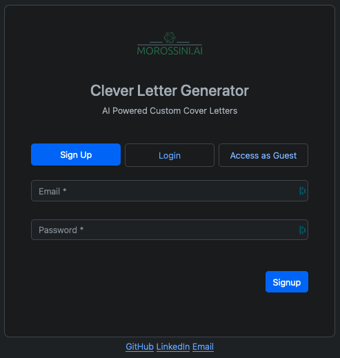
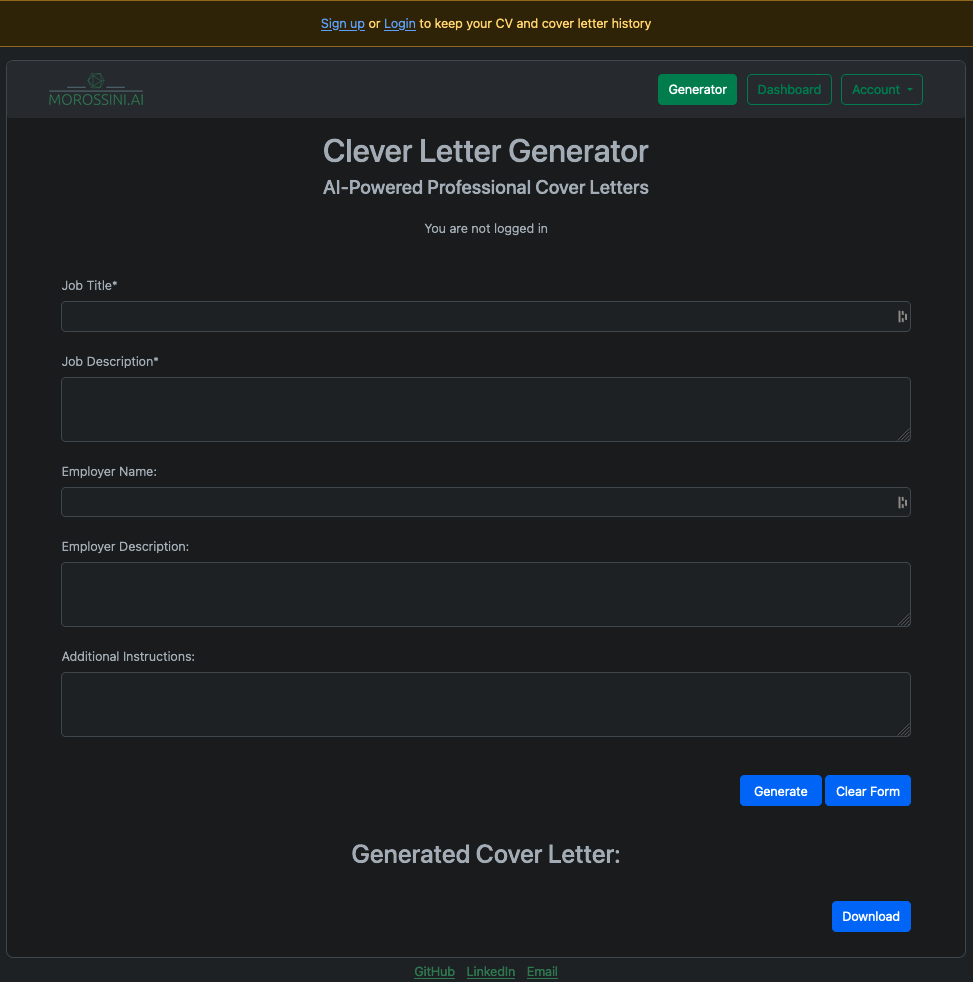
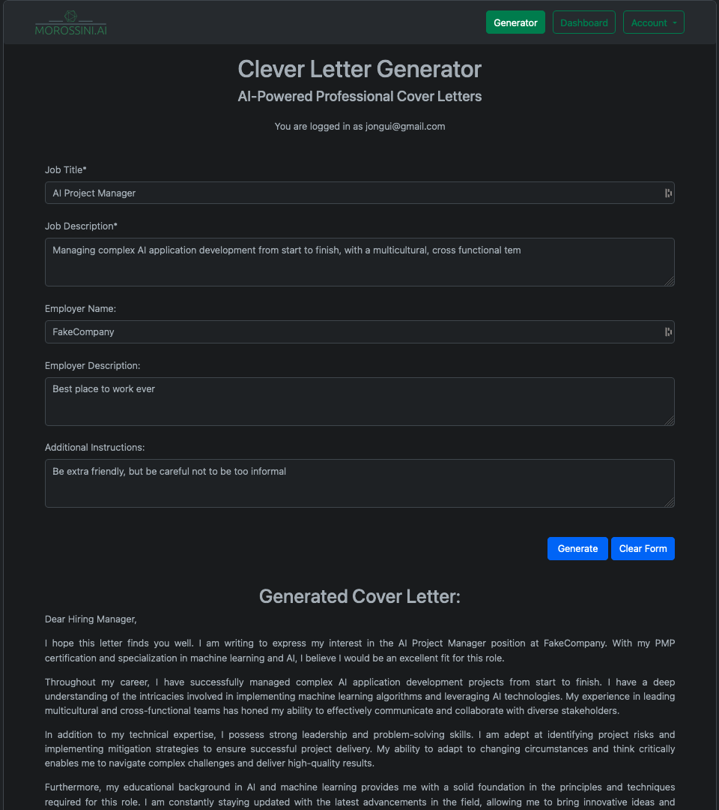
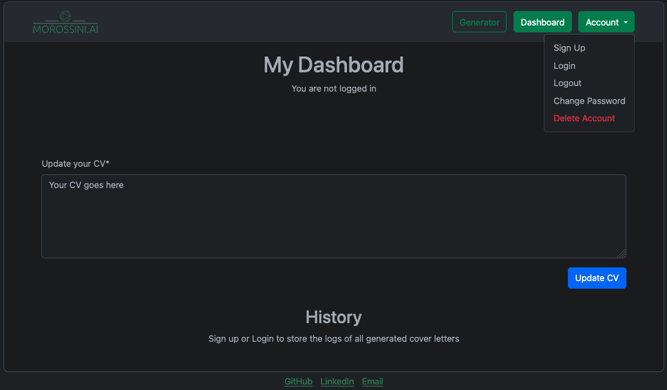
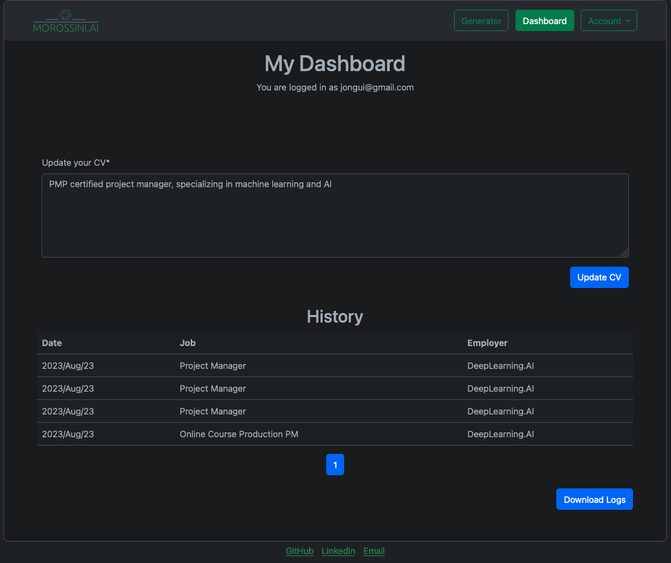

# Clever Letter Generator
### AI-Powered Professional Cover Letters

---

### Live Demo
https://www.morossini.me/cleverletter/

---

### About This Version
In this version, login is optional and the api calls are paid by the site owner.
For a version in which both authentication and a user OpenAI API key are required, go to branch [login_required](https://github.com/joaomorossini/Clever-Letter-Generator/tree/login_required)

---

### Table of Contents
#### 1. Contact
#### 2. Features
#### 3. Screenshots
#### 4. License

---
### 1. Contact
For any queries or support, please reach out through one of the following channels:

- [GitHub](https://github.com/joaomorossini/)
- [LinkedIn](https://www.linkedin.com/in/joaomorossini/)
- [Email](mailto:ai.clever.letter@gmail.com)

---

### 2. Features
The Clever Letter Generator is a Flask-based web application that uses AI to generate custom cover letters. It includes the following features:

- Unauthenticated use: Users can use the app without logging in, but their cvs and cover letter logs will only be stored in the current session, not in the database
- User Registration and Login: Users can create an account and log in to access the cover letter generator.
- Rate Limiting: To prevent abuse, the application limits the number of requests a user can make per minute or per day.
- Secure Password Hashing: User passwords are securely hashed using Bcrypt.
- Email Support: The application uses Flask-Mail for email functionality.
- API Key Management: API calls covered by site owner.
- Cover Letter Generation: Users can generate a custom cover letter by providing details such as job title, job description, employer name, employer description, and additional instructions.
- Downloadable Cover Letters: Generated cover letters can be downloaded as text files.
- Logging: The application logs each cover letter generation event for auditing purposes.

---

### 3. Screenshots

##### Sign Up

##### Login

##### Guest Access

#### Generated Cover Letter

##### Unauthenticated Dashboard

##### Authenticated Dashboard

---

### 4. License
This project is licensed under the terms of the MIT license. For more details, please see the LICENSE file in the project repository.
